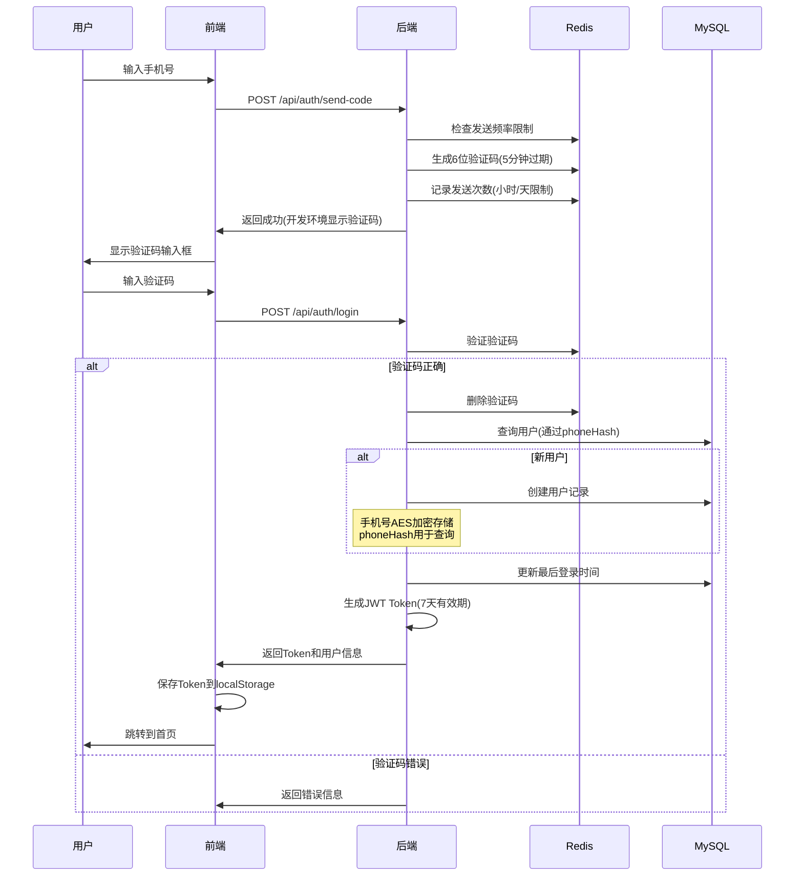
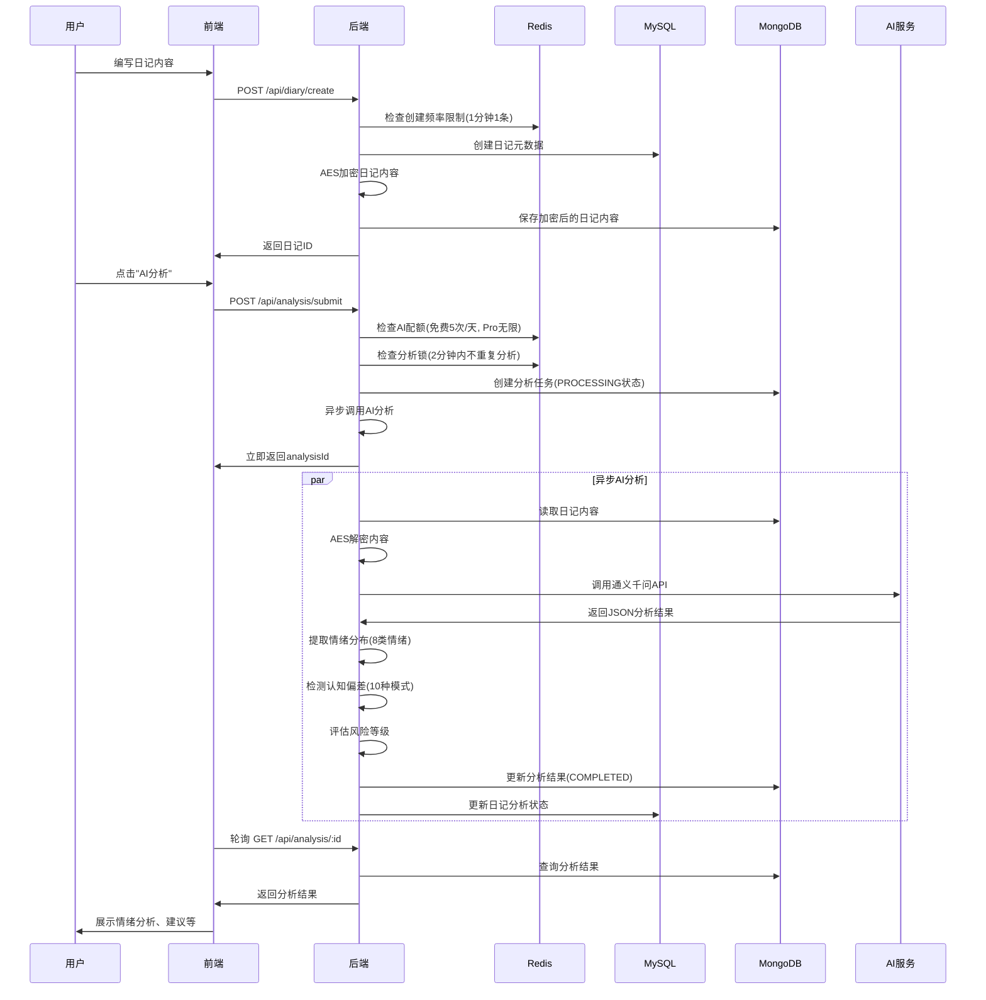
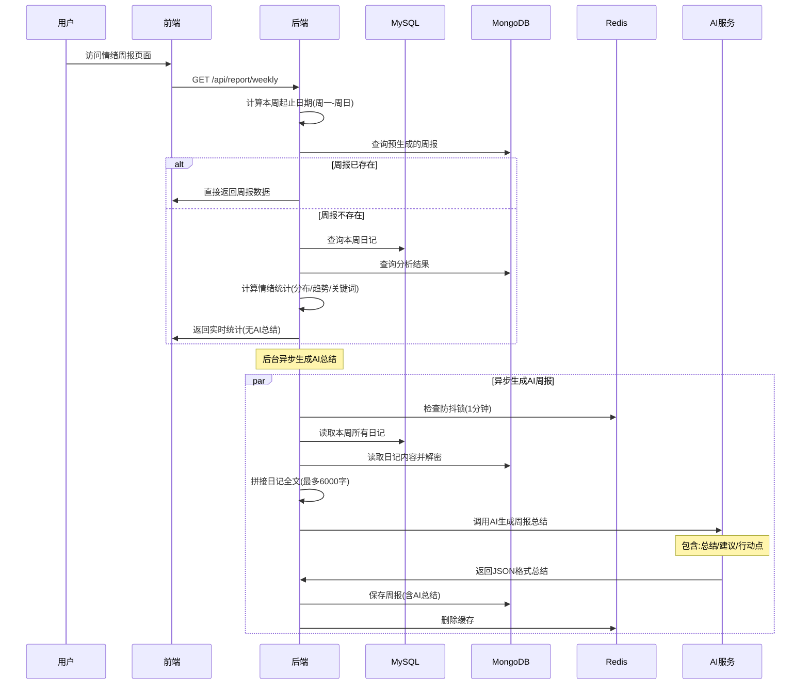
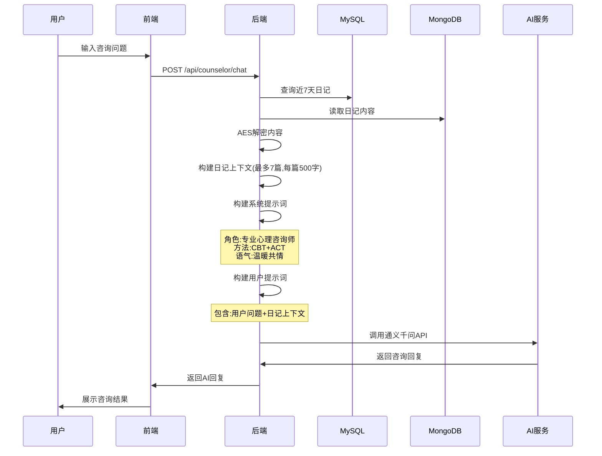
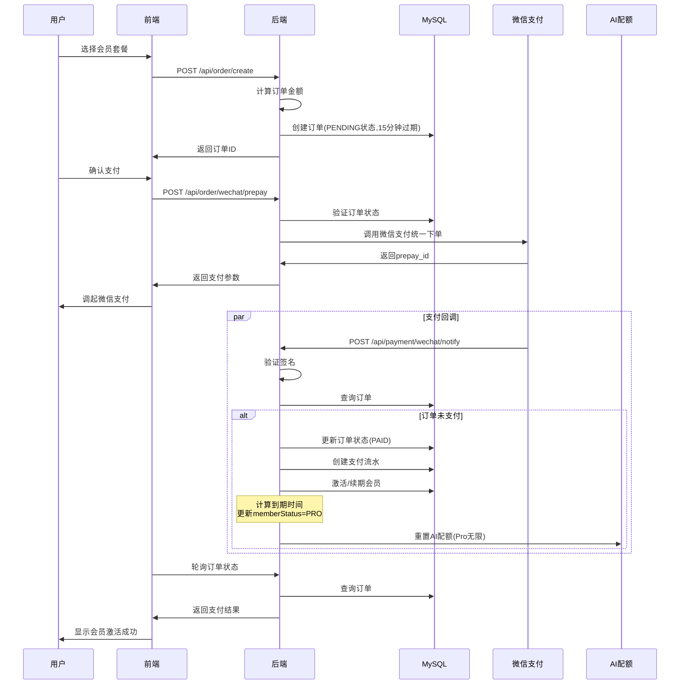

# 心迹 (XinJi) 业务逻辑设计文档

## 一、业务模块概览

心迹系统包含以下核心业务模块：

1. **用户认证模块** - 手机号验证码登录/注册
2. **日记管理模块** - 日记的CRUD操作
3. **AI分析模块** - 情绪分析、认知偏差检测
4. **报告生成模块** - 周报、深度洞察报告
5. **AI咨询模块** - 基于日记的AI心理咨询
6. **会员订单模块** - 订单创建、支付、会员激活
7. **心理训练模块** - 正念冥想、认知重构等训练

---

## 二、核心业务流程图

### 2.1 用户认证流程

### 2.2 日记创建与分析流程

### 2.3 周报生成流程

### 2.4 AI心理咨询流程

### 2.5 会员订单与支付流程

---

## 三、详细业务逻辑设计

### 3.1 用户认证模块

#### 3.1.1 验证码发送
- **输入**: 手机号
- **处理逻辑**:
  1. 检查发送频率限制(每小时5次,每天10次)
  2. 生成6位随机数字验证码
  3. 存储到Redis,5分钟过期
  4. 记录发送次数(用于限流)
  5. 开发环境:日志输出验证码;生产环境:调用短信服务
- **输出**: 成功/失败消息

#### 3.1.2 登录/注册
- **输入**: 手机号 + 验证码
- **处理逻辑**:
  1. 验证验证码(从Redis读取并比对)
  2. 验证成功后删除验证码
  3. 通过phoneHash查询用户
  4. 新用户:创建用户记录(手机号AES加密,生成phoneHash)
  5. 更新最后登录时间
  6. 生成JWT Token(7天有效期,支持刷新)
- **输出**: Token + 用户基本信息

#### 3.1.3 Token刷新
- **输入**: 旧Token
- **处理逻辑**:
  1. 验证Token是否在刷新窗口内(1天)
  2. 从Token中提取userId(支持过期Token)
  3. 验证用户存在
  4. 生成新Token
- **输出**: 新Token

---

### 3.2 日记管理模块

#### 3.2.1 日记创建
- **输入**: 标题、内容、日期、是否草稿
- **处理逻辑**:
  1. 检查创建频率限制(1分钟1条)
  2. 创建日记元数据(MySQL):
     - 标题、日期、用户ID
     - 是否草稿、是否已分析(默认0)
  3. AES加密日记内容
  4. 保存到MongoDB:
     - 加密后的内容
     - 内容预览(前100字,去除HTML)
  5. 如果是正式日记(非草稿),触发周报刷新
- **输出**: 日记ID和基本信息

#### 3.2.2 日记更新
- **输入**: 日记ID + 更新内容
- **处理逻辑**:
  1. 验证日记存在且属于当前用户
  2. 更新元数据(标题、草稿状态)
  3. 如果内容变化:
     - 重新加密并保存
     - 标记为未分析(analyzed=0)
     - 清空分析ID和情绪信息
  4. 如果是正式日记,触发周报刷新
- **输出**: 更新后的日记信息

#### 3.2.3 日记查询
- **输入**: 分页参数、日期范围、关键词
- **处理逻辑**:
  1. 从MySQL查询日记元数据(分页)
  2. 从MongoDB批量查询内容预览
  3. 内存中关键词过滤(基于预览内容)
  4. 组装响应(不包含完整内容,需详情接口)
- **输出**: 分页的日记列表

#### 3.2.4 日记删除
- **输入**: 日记ID
- **处理逻辑**:
  1. 验证权限
  2. 逻辑删除(MySQL设置deleted=1)
  3. MongoDB内容保留(用于数据恢复)
- **输出**: 成功消息

---

### 3.3 AI分析模块

#### 3.3.1 提交分析请求
- **输入**: 日记ID
- **处理逻辑**:
  1. 验证日记存在且属于当前用户
  2. 检查AI配额:
     - 免费用户:每日5次
     - Pro用户:每日1000次(实际无限)
  3. 检查分析锁(2分钟内不重复分析)
  4. 从MongoDB读取日记内容并解密
  5. 创建分析任务(PROCESSING状态)
  6. 异步执行AI分析
  7. 增加配额使用计数
- **输出**: 分析任务ID和状态

#### 3.3.2 AI分析执行(异步)
- **处理逻辑**:
  1. 调用阿里云通义千问API:
     - 模型: qwen-plus
     - 提示词: 分析日记情绪,返回JSON
     - 要求: 8类情绪分布、关键词、建议
  2. 解析AI返回结果:
     - 提取情绪分布(8类: HAPPY/SAD/ANGRY/FEAR/SURPRISE/DISGUST/NEUTRAL/ANXIOUS)
     - 提取关键词(最多10个)
     - 提取调节建议
  3. 检测认知偏差:
     - 通过关键词匹配检测10种认知偏差模式
     - 如: 灾难化思维("完蛋"、"毁了")
     - 非黑即白("总是"、"从不")
  4. 评估风险等级:
     - 检查高风险关键词(自杀相关)
     - 计算负面情绪强度
     - 等级: LOW/MEDIUM/HIGH
  5. 更新分析结果:
     - 状态: COMPLETED
     - 保存到MongoDB
  6. 更新日记元数据:
     - analyzed=1
     - 保存分析ID、主导情绪、情绪强度
- **异常处理**: AI调用失败时,使用默认分析结果

#### 3.3.3 查询分析结果
- **输入**: 分析ID
- **处理逻辑**:
  1. 从MongoDB查询分析结果
  2. 验证用户权限
  3. 返回完整分析数据
- **输出**: 分析结果(情绪、关键词、建议、认知偏差、风险等级)

---

### 3.4 周报生成模块

#### 3.4.1 获取周报
- **输入**: 周起始日期(可选,默认本周)
- **处理逻辑**:
  1. 计算周的起止日期(周一-周日)
  2. 优先从MongoDB查询预生成的周报
  3. 如果存在且含AI总结,直接返回
  4. 否则实时计算:
     - 查询本周日记
     - 查询分析结果
     - 计算情绪统计(分布、趋势、关键词)
     - 返回统计信息(无AI总结)
  5. 缓存结果(Redi