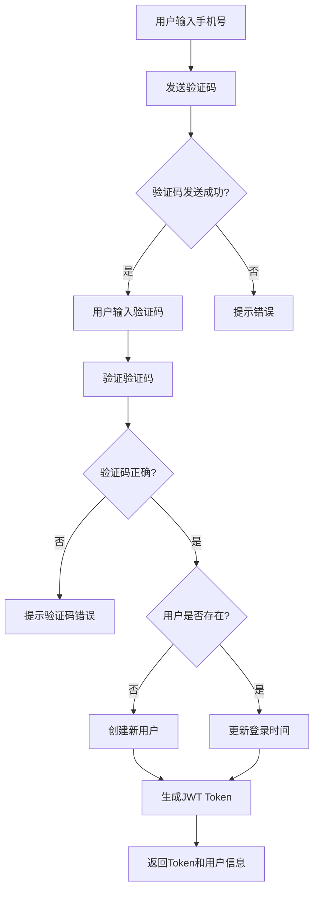
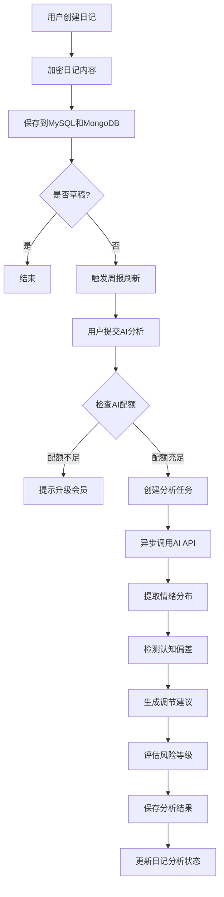
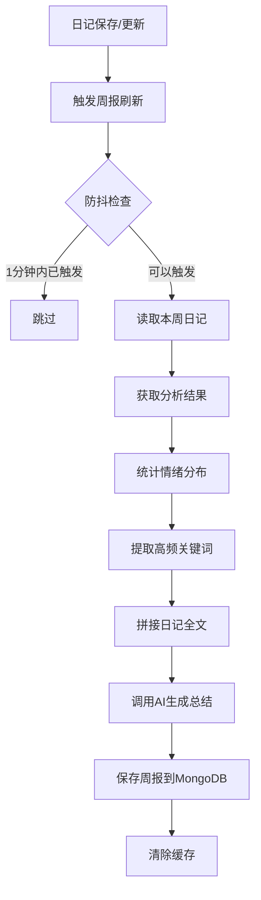
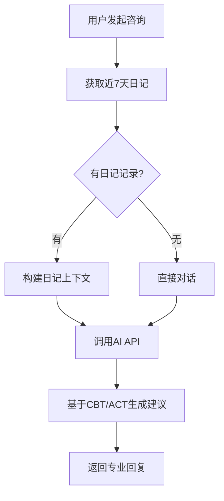
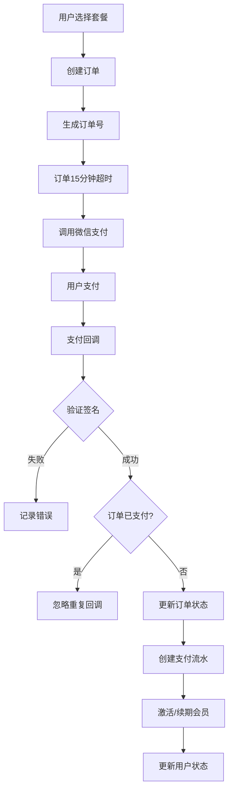
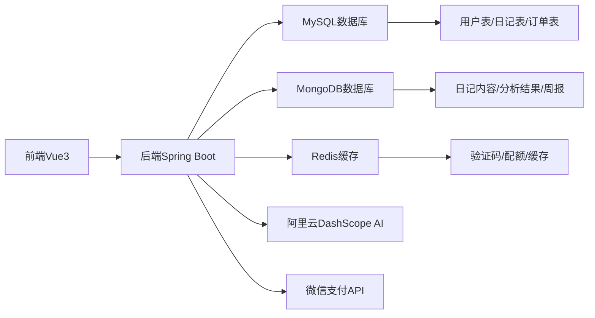
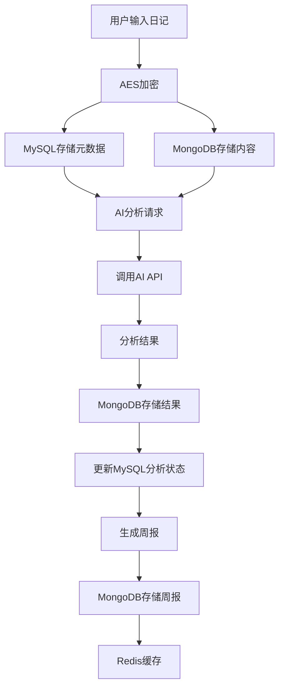
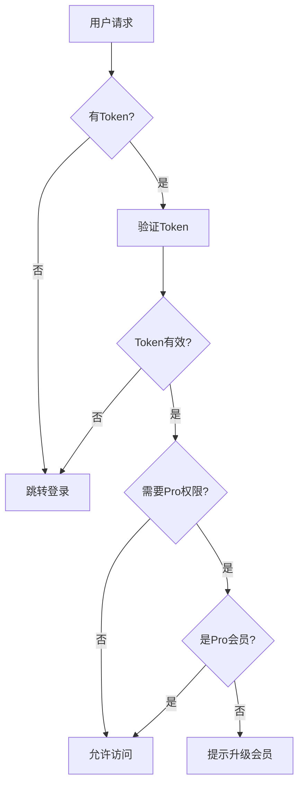

# 心迹 (XinJi) 业务逻辑流程图

## 一、用户认证流程

```mermaid
graph TD
    A[用户输入手机号] --> B[发送验证码]
    B --> C{验证码发送成功?}
    C -->|是| D[用户输入验证码]
    C -->|否| E[提示错误]
    D --> F[验证验证码]
    F --> G{验证码正确?}
    G -->|否| H[提示验证码错误]
    G -->|是| I{用户是否存在?}
    I -->|否| J[创建新用户]
    I -->|是| K[更新登录时间]
    J --> L[生成JWT Token]
    K --> L
    L --> M[返回Token和用户信息]
```

## 二、日记创建与分析流程

```mermaid
graph TD
    A[用户创建日记] --> B[加密日记内容]
    B --> C[保存到MySQL和MongoDB]
    C --> D{是否草稿?}
    D -->|是| E[结束]
    D -->|否| F[触发周报刷新]
    F --> G[用户提交AI分析]
    G --> H{检查AI配额}
    H -->|配额不足| I[提示升级会员]
    H -->|配额充足| J[创建分析任务]
    J --> K[异步调用AI API]
    K --> L[提取情绪分布]
    L --> M[检测认知偏差]
    M --> N[生成调节建议]
    N --> O[评估风险等级]
    O --> P[保存分析结果]
    P --> Q[更新日记分析状态]
```

## 三、周报生成流程

```mermaid
graph TD
    A[日记保存/更新] --> B[触发周报刷新]
    B --> C{防抖检查}
    C -->|1分钟内已触发| D[跳过]
    C -->|可以触发| E[读取本周日记]
    E --> F[获取分析结果]
    F --> G[统计情绪分布]
    G --> H[提取高频关键词]
    H --> I[拼接日记全文]
    I --> J[调用AI生成总结]
    J --> K[保存周报到MongoDB]
    K --> L[清除缓存]
```

## 四、AI心理咨询流程

```mermaid
graph TD
    A[用户发起咨询] --> B[获取近7天日记]
    B --> C{有日记记录?}
    C -->|有| D[构建日记上下文]
    C -->|无| E[直接对话]
    D --> F[调用AI API]
    E --> F
    F --> G[基于CBT/ACT生成建议]
    G --> H[返回专业回复]
```

## 五、订单支付流程

```mermaid
graph TD
    A[用户选择套餐] --> B[创建订单]
    B --> C[生成订单号]
    C --> D[订单15分钟超时]
    D --> E[调用微信支付]
    E --> F[用户支付]
    F --> G[支付回调]
    G --> H{验证签名}
    H -->|失败| I[记录错误]
    H -->|成功| J{订单已支付?}
    J -->|是| K[忽略重复回调]
    J -->|否| L[更新订单状态]
    L --> M[创建支付流水]
    M --> N[激活/续期会员]
    N --> O[更新用户状态]
```

## 六、系统架构流程

```mermaid
graph LR
    A[前端Vue3] --> B[后端Spring Boot]
    B --> C[MySQL数据库]
    B --> D[MongoDB数据库]
    B --> E[Redis缓存]
    B --> F[阿里云DashScope AI]
    B --> G[微信支付API]
    
    C --> H[用户表/日记表/订单表]
    D --> I[日记内容/分析结果/周报]
    E --> J[验证码/配额/缓存]
```

## 七、数据流转图

```mermaid
graph TD
    A[用户输入日记] --> B[AES加密]
    B --> C[MySQL存储元数据]
    B --> D[MongoDB存储内容]
    C --> E[AI分析请求]
    D --> E
    E --> F[调用AI API]
    F --> G[分析结果]
    G --> H[MongoDB存储结果]
    H --> I[更新MySQL分析状态]
    I --> J[生成周报]
    J --> K[MongoDB存储周报]
    K --> L[Redis缓存]
```

## 八、权限控制流程

```mermaid
graph TD
    A[用户请求] --> B{有Token?}
    B -->|否| C[跳转登录]
    B -->|是| D[验证Token]
    D --> E{Token有效?}
    E -->|否| C
    E -->|是| F{需要Pro权限?}
    F -->|否| G[允许访问]
    F -->|是| H{是Pro会员?}
    H -->|否| I[提示升级会员]
    H -->|是| G
```

