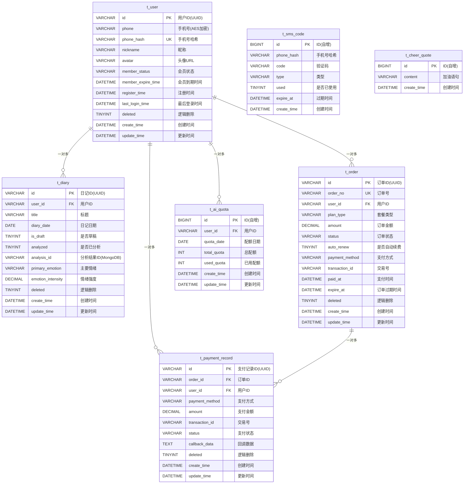
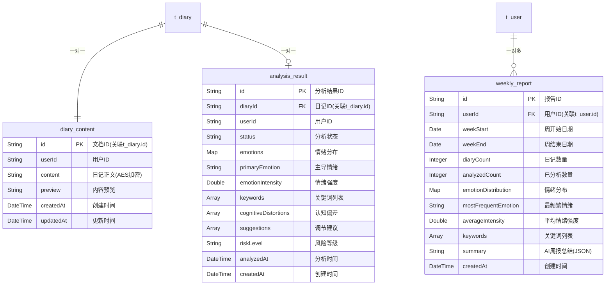
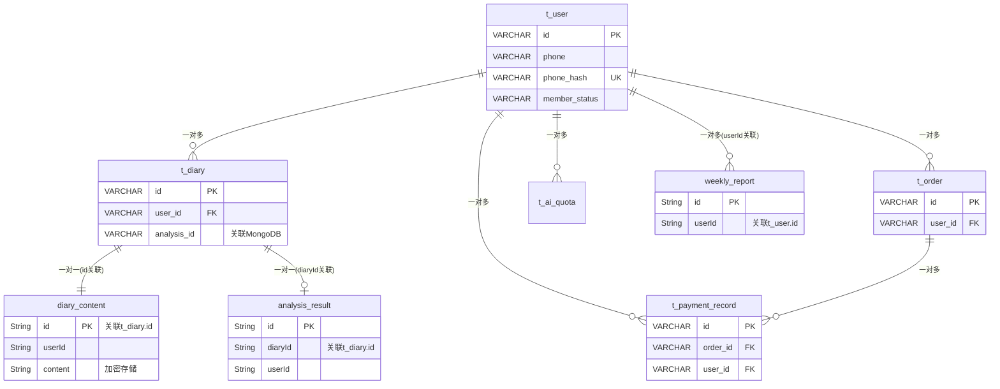

# 心迹 (XinJi) 数据库ER图

## 一、MySQL数据库ER图

## 二、MongoDB集合关系图

## 三、完整数据库架构关系图

## 四、表关系说明

### MySQL表关系

1. **t_user (用户表)** - 核心表
   - 一对多关系：一个用户可以有多个日记、多个订单、多个支付记录、多个配额记录

2. **t_diary (日记表)**
   - 多对一关系：多个日记属于一个用户
   - 关联MongoDB：通过`analysis_id`关联`analysis_result`集合，通过`id`关联`diary_content`集合

3. **t_order (订单表)**
   - 多对一关系：多个订单属于一个用户
   - 一对多关系：一个订单可以有多个支付记录（支持多次支付尝试）

4. **t_payment_record (支付记录表)**
   - 多对一关系：多个支付记录属于一个订单和一个用户

5. **t_ai_quota (AI配额表)**
   - 多对一关系：多个配额记录属于一个用户（按日期区分）

6. **t_sms_code (验证码表)**
   - 通过`phone_hash`与`t_user`关联查询（非外键约束）

7. **t_cheer_quote (心灵加油站表)**
   - 独立表，无外键关系

### MongoDB集合关系

1. **diary_content (日记内容集合)**
   - 与`t_diary`一对一关系，通过`id`字段关联

2. **analysis_result (分析结果集合)**
   - 与`t_diary`一对一关系，通过`diaryId`字段关联

3. **weekly_report (周报集合)**
   - 与`t_user`一对多关系，通过`userId`字段关联

## 五、数据存储策略

- **MySQL**: 存储结构化数据，支持事务和复杂查询
- **MongoDB**: 存储非结构化数据（日记正文、AI分析结果、周报），支持灵活的数据结构
- **Redis**: 缓存热点数据（验证码、配额计数、周报缓存）

## 六、索引设计

### MySQL索引
- `t_user`: `phone_hash`(唯一索引), `member_status`, `member_expire_time`
- `t_diary`: `user_id`, `diary_date`, `(user_id, diary_date)`复合索引
- `t_order`: `order_no`(唯一索引), `user_id`, `status`, `expire_at`
- `t_payment_record`: `order_id`, `user_id`, `transaction_id`

### MongoDB索引
- `diary_content`: `id`(主键), `userId`
- `analysis_result`: `id`(主键), `diaryId`, `userId`
- `weekly_report`: `id`(主键), `userId`, `weekStart`

